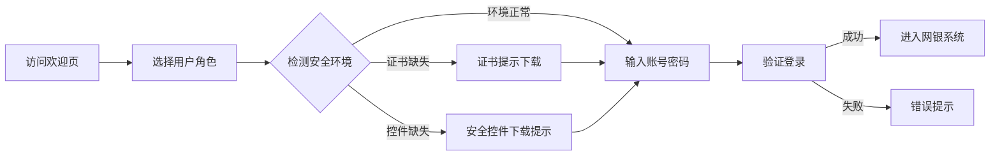

## 1. 产品概述

银行网银欢迎页，作为个人用户、企业用户和小微企业用户的统一登录入口，提供清晰的角色选择、安全的登录体验以及便捷的辅助服务（安全控件下载、公告、帮助热线、证书提示）。

- 核心目标：通过清晰的角色区分和完善的安全提示，提升用户登录效率和安全感
- 目标用户：个人网银用户、企业财务人员、小微企业经营者

---

## 2. 核心功能

### 2.1 用户角色

| 角色 | 登录方式 | 核心功能 |
|------|----------|----------|
| 个人用户 | 用户名/手机号 + 密码 | 账户查询、转账、理财、个人贷款 |
| 企业用户 | 企业账号 + UKey/证书 | 对公账户、批量支付、代发工资、票据业务 |
| 小微企业 | 法人账号 + 密码/证书 | 小微贷款、对公结算、财务管理 |

### 2.2 功能模块

1. **欢迎页首屏**：角色切换标签（个人/企业/小微）、品牌展示区、登录框
2. **登录模块**：账号输入、密码输入、验证码、记住账号、忘记密码
3. **安全辅助模块**：安全控件下载、证书检测与提示、登录安全提示
4. **信息服务模块**：滚动公告栏、最新动态
5. **帮助服务模块**：帮助热线、在线客服入口、常见问题

### 2.3 页面详情

| 页面名称 | 模块名称 | 功能描述 |
|---------|----------|----------|
| 网银欢迎页 | 角色切换区 | 顶部标签式切换，个人/企业/小微三种入口，首屏可见 |
| 网银欢迎页 | 品牌展示区 | 银行Logo、品牌标语、背景装饰 |
| 网银欢迎页 | 登录核心区 | 居中登录表单，包含账号、密码、验证码输入 |
| 网银欢迎页 | 安全控件下载 | 登录框下方，提供Windows/Mac版本下载 |
| 网银欢迎页 | 公告栏 | 登录框左侧/右侧滚动展示重要公告 |
| 网银欢迎页 | 帮助热线 | 登录框上方或下方醒目展示7x24小时服务热线 |
| 网银欢迎页 | 证书提示 | 登录框右侧，检测并提示数字证书状态 |

---

## 3. 核心流程

用户打开网银欢迎页 → 选择角色（个人/企业/小微）→ 系统自动检测证书和安全控件 → 用户输入账号密码 → 验证通过进入网银系统

---

## 4. 用户界面设计

### 4.1 设计风格

- **主色调**：深邃藏蓝 `#0A1628`（专业、可信），辅以金融金 `#C9A96E`（尊贵、品质）
- **辅助色**：安全绿 `#10B981`（安全、成功），警示橙 `#F59E0B`（提醒、注意）
- **按钮风格**：圆角矩形按钮，主按钮使用渐变蓝，hover时有微妙的光影变化
- **字体**：展示字体使用 `Cormorant Garamond`（衬线，金融质感），正文字体使用 `Inter`（清晰易读）
- **布局风格**：卡片式布局，登录框居中，四周环绕辅助功能模块
- **图标**：使用 lucide-react 线性图标，统一 20px 尺寸

### 4.2 页面设计概览

| 页面名称 | 模块名称 | UI 元素 |
|---------|----------|----------|
| 网银欢迎页 | 角色切换标签 | 顶部三标签，选中态使用金色下划线和加粗 |
| 网银欢迎页 | 登录框 | 白色卡片，柔和阴影，圆角 12px，输入框有焦点动效 |
| 网银欢迎页 | 公告栏 | 半透明深色背景，图标 + 文字横向滚动 |
| 网银欢迎页 | 帮助热线 | 金色图标 + 大号数字，醒目但不突兀 |
| 网银欢迎页 | 安全控件下载 | 卡片式设计，带有系统图标和下载按钮 |
| 网银欢迎页 | 证书提示 | 状态指示器（绿/橙/红）+ 操作按钮 |

### 4.3 响应式设计

- **设计原则**：Desktop-first，重点适配平板（768px - 1024px）
- **平板适配**：
  - 角色标签保持首屏可见，字号适当缩小
  - 登录框保持居中，宽度自适应
  - 辅助模块从环绕式改为上下堆叠式
  - 帮助热线和安全信息保持高可读性
  - 触摸区域增大至 44x44px

### 4.4 视觉动效

- 页面加载时，各模块按顺序淡入（staggered reveal）
- 角色切换时，登录表单平滑过渡
- 输入框焦点时有轻微的光晕效果
- 按钮 hover 时有微妙的上浮和阴影加深
- 公告文字平滑滚动
