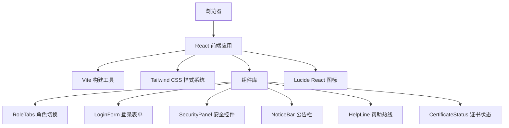

## 1. 架构设计



## 2. 技术描述

- **前端**：React 18 + TypeScript 5 + Tailwind CSS 3 + Vite 5
- **状态管理**：React useState / useEffect 管理本地状态
- **路由**：React Router DOM 6（单页面应用）
- **图标库**：lucide-react
- **构建工具**：Vite 5

## 3. 路由定义

| 路由 | 页面 | 说明 |
|------|------|------|
| `/` | 网银欢迎页 | 包含角色切换、登录框、安全控件、公告、帮助热线、证书提示 |

## 4. 项目结构

```
src/
├── components/
│   ├── RoleTabs.tsx          # 角色切换标签（个人/企业/小微）
│   ├── LoginForm.tsx         # 登录表单组件
│   ├── SecurityPanel.tsx     # 安全控件下载面板
│   ├── NoticeBar.tsx         # 滚动公告栏
│   ├── HelpLine.tsx          # 帮助热线组件
│   └── CertificateStatus.tsx # 证书状态提示
├── pages/
│   └── WelcomePage.tsx       # 网银欢迎页主页面
├── App.tsx                   # 应用入口
├── main.tsx                  # React 入口
└── index.css                 # 全局样式 + Tailwind 配置
```

## 5. 组件设计规范

### 5.1 组件接口定义

```typescript
// 角色类型
type UserRole = 'personal' | 'enterprise' | 'sme';

// RoleTabs Props
interface RoleTabsProps {
  activeRole: UserRole;
  onRoleChange: (role: UserRole) => void;
}

// LoginForm Props
interface LoginFormProps {
  role: UserRole;
  onSubmit: (data: LoginData) => void;
}

// SecurityPanel Props
interface SecurityPanelProps {
  onDownload: (os: 'windows' | 'mac') => void;
}

// CertificateStatus Props
interface CertificateStatusProps {
  status: 'valid' | 'expired' | 'missing';
  onFix: () => void;
}
```

### 5.2 状态管理

- 使用 React `useState` 管理当前选中角色 `activeRole`
- 使用 `useState` 管理登录表单输入
- 使用 `useEffect` 处理公告滚动动画
- 使用 CSS 变量定义主题色，确保全局一致

### 5.3 响应式断点

```javascript
// tailwind.config.js
screens: {
  'sm': '640px',   // 手机
  'md': '768px',   // 平板竖屏
  'lg': '1024px',  // 平板横屏/小桌面
  'xl': '1280px',  // 桌面
}
```

## 6. 性能优化

- 使用 CSS 动画而非 JS 动画，提升渲染性能
- 组件按需渲染，角色切换时仅更新必要内容
- 图片资源使用 WebP 格式（如有）
- 首屏加载时使用 staggered reveal 动画，提升感知性能
